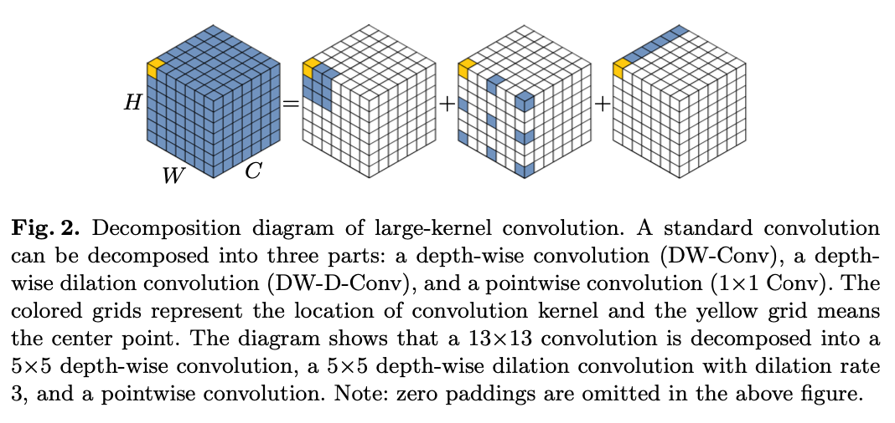
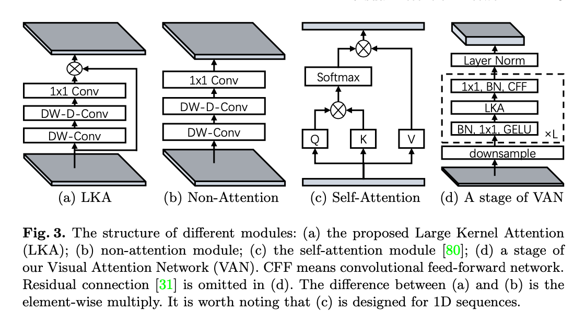
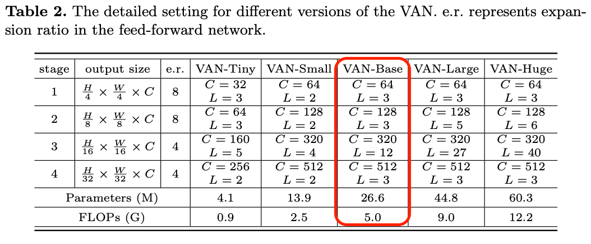
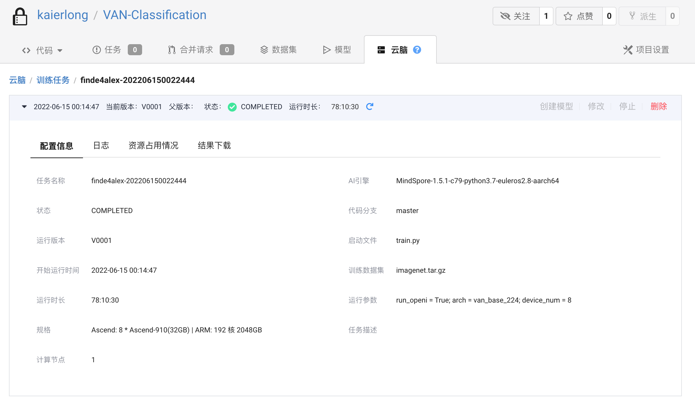
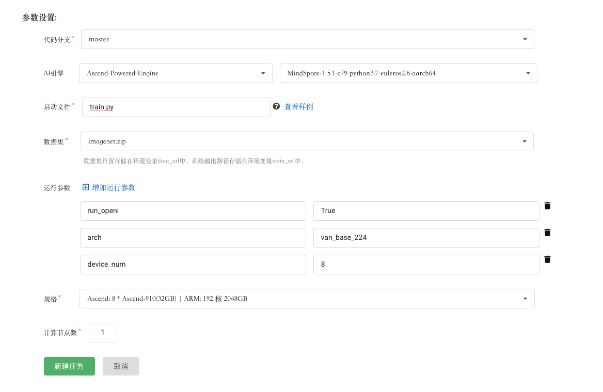
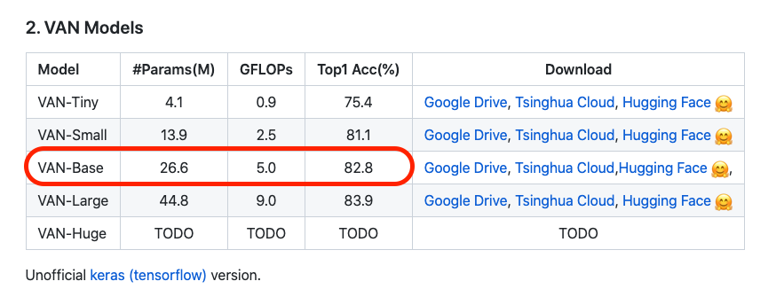
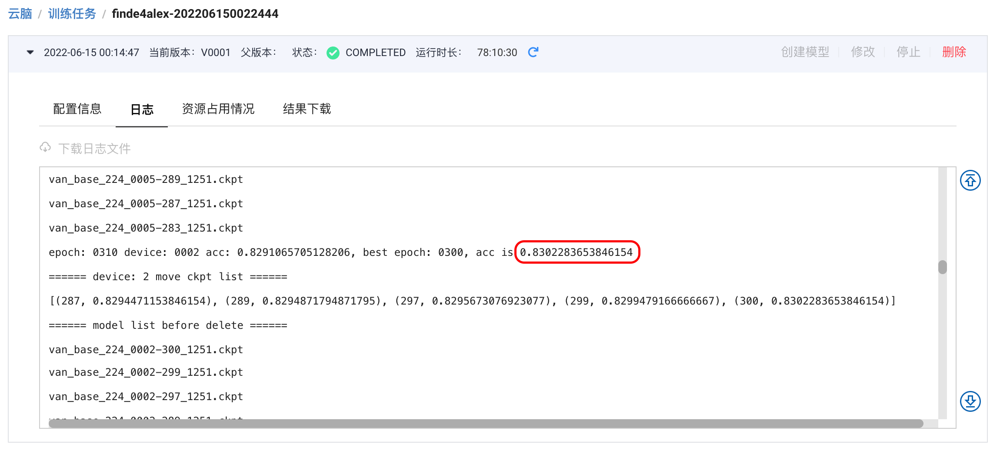

# VAN模型自验报告

> 邢朝龙 kaierlong@126.com


## 1. 模型简介

### 1.1 网络模型结构简介

`Visual Attention Network（VAN）`是2022年提出的视觉领域的网络结构。

传统的将NLP领域的self-attention应用于2D图像时，会面临三个问题：

- 将图像处理为一维序列，忽略了其2D结构
- 二次复杂度对于高分辨率的图像来说，计算量剧增
- 只捕捉了空间适应性，而忽略了通道适应性

针对以上问题，论文提出适用于视觉任务的`large kernel attention（LKA）`。

 

<center>图1</center>

如图1，一个大尺寸的卷积可以分成三部分：

- 空间上的局部卷积（depth-wise convolution）
- 空间上的long-range convolution （depth-wise dilation convolution）
- 通道上的卷积 （1x1 convolution）



<center>图2</center>

拆分后的卷积可以捕捉长距离信息，并且节省计算资源，得到长距离关系后，能够估计每个点的重要程度，生成attention map，如图二所示。

最终，LKA的数学表达如下图3所示。


<center>图3</center>

VAN 结构简单，有四层，不同量级的模型结构如下图4所示，本文所选模型结构为红色标记部分。




### 1.2 数据集

使用训练及测试数据集如下：

```shell
使用的数据集：ImageNet2012

数据集大小：共1000个类、224*224彩色图像
训练集：共1,281,167张图像
测试集：共50,000张图像
数据格式：JPEG
注：数据在dataset.py中处理。
下载数据集，目录结构如下：
└─dataset
   ├─train                 # 训练数据集
   └─val                   # 评估数据集
```


### 1.3 代码提交地址

暂时提交在启智中，私有未开源。

仓库地址如下：https://git.openi.org.cn/kaierlong/VAN-Classification.git


## 2. 代码目录结构说明

代码目录结构及说明如下：

```shell
.
├── eval.py        // 评估文件
├── image        // 文档图片目录
├── LICENSE
├── README_CN.md        // 中文说明文档
├── README.md        // 说明文档
├── src
│   ├── args.py
│   ├── configs        // 超参数配置目录
│   │   ├── parser.py
│   │   ├── van_base_224.yaml
│   │   ├── van_large_224.yaml
│   │   ├── van_small_224.yaml
│   │   └── van_tiny_224.yaml
│   ├── data        // 数据加载及处理目录
│   │   ├── augment
│   │   │   ├── auto_augment.py
│   │   │   ├── __init__.py
│   │   │   ├── mixup.py
│   │   │   └── random_erasing.py
│   │   ├── data_utils
│   │   │   ├── __init__.py
│   │   │   └── moxing_adapter.py
│   │   ├── imagenet.py
│   │   └── __init__.py
│   ├── models        // 模型目录
│   │   ├── __init__.py
│   │   └── van
│   │       ├── get_van.py
│   │       ├── __init__.py
│   │       ├── misc.py
│   │       └── van.py        // vand定义文件
│   ├── tools        // 相关工具目录
│   │   ├── callback.py
│   │   ├── cell.py
│   │   ├── criterion.py
│   │   ├── get_misc.py
│   │   ├── __init__.py
│   │   ├── optimizer.py
│   │   └── schedulers.py
│   └── trainers        // 训练优化目录
│       ├── __init__.py
│       └── train_one_step_with_scale_and_clip_global_norm.py
└── train.py        // 训练文件
```


## 3. 自验结果（交付精度规格时需要补齐）

### 3.1 自验环境

软硬件环境如下：

- 启智AI引擎：MindSpore-1.5.1-c79-python3.7-euleros2.8-aarch64
- Ascend: 8 * Ascend-910(32GB) | ARM: 192 核 2048GB


**详细环境配置参见下图：**




### 3.2 训练超参数

超参数配置如下：

> 其中data_url由启智平台实际数据地址替换，训练时替换。

```yaml
# Architecture
arch: van_base_224

# ===== Dataset ===== #
data_url: ./data/imagenet
set: ImageNet
num_classes: 1000
mix_up: 0.8
cutmix: 1.0
auto_augment: rand-m9-mstd0.5-inc1
interpolation: bicubic
re_prob: 0.0
re_mode: pixel
re_count: 1
mixup_prob: 1.
switch_prob: 0.5
mixup_mode: batch
crop_ratio: 0.9

# ===== Learning Rate Policy ======== #
optimizer: adamw
lr_scheduler: cosine_lr
base_lr: 0.0005
min_lr: 0.000001
warmup_lr:  0.000001
warmup_length: 5
cool_length: 10
cool_lr: 0.000001


# ===== Network training config ===== #
amp_level: O1
keep_bn_fp32: True
beta: [ 0.9, 0.999 ]
clip_global_norm_value: 10.
is_dynamic_loss_scale: True
epochs: 310
label_smoothing: 0.1
loss_scale: 1024
weight_decay: 0.05
momentum: 0.9
batch_size: 128

# ===== Hardware setup ===== #
num_parallel_workers: 32
device_target: Ascend

# ===== Model config ===== #
drop_path_rate: 0.2
embed_dims: [64, 128, 320, 512]
mlp_ratios: [8, 8, 4, 4]
depths: [3, 3, 12, 3]
num_stages: 4
image_size: 224
```


### 3.3 训练

### 3.3.1 如何启动训练脚本

训练如何启动：

- 启智平台

模型训练在启智平台完成，完整训练配置如下图所示：



- 本地命令

**如果需要本地训练，可以使用如下命令：**

```shell
python3 train.py --run_openi=True --arch=van_base_224 --dataset_sink_mode=False --device_num=8
```


#### 3.3.2 训练精度结果

- 论文精度如下:



- 复现精度如下：



- 精度结果对比

  - 论文精度为：82.8

  - 复现精度为：83.02（最优值）

  - 比论文还要好0.202个绝对百分点，相对提升0.26%

```shell
83.02 - 82.8 = 0.202
(83.02 - 82.8) / 82.8 * 100 = 0.2657
```


### 3.4 模型推理

推理命令如下：

```shell
python3 eval.py --config=src/configs/van_base_224.yaml --pretrained={ckpt_path} --device_id={device_id} --device_target={device_target} --data_url={data_url}
```


## 4. 参考资料

### 4.1 参考论文

- [2202.09741\] Visual Attention Network (arxiv.org)](https://arxiv.org/abs/2202.09741)


### 4.2 参考git项目

- [Visual-Attention-Network/VAN-Classification (github.com)](https://github.com/Visual-Attention-Network/VAN-Classification)


### 4.3 参考文献

- [【Attention】Visual Attention Network_呆呆的猫的博客-CSDN博客](https://blog.csdn.net/jiaoyangwm/article/details/123233044)
- [【ARXIV2202】Visual Attention Network - 知乎 (zhihu.com)](https://zhuanlan.zhihu.com/p/474526444)
